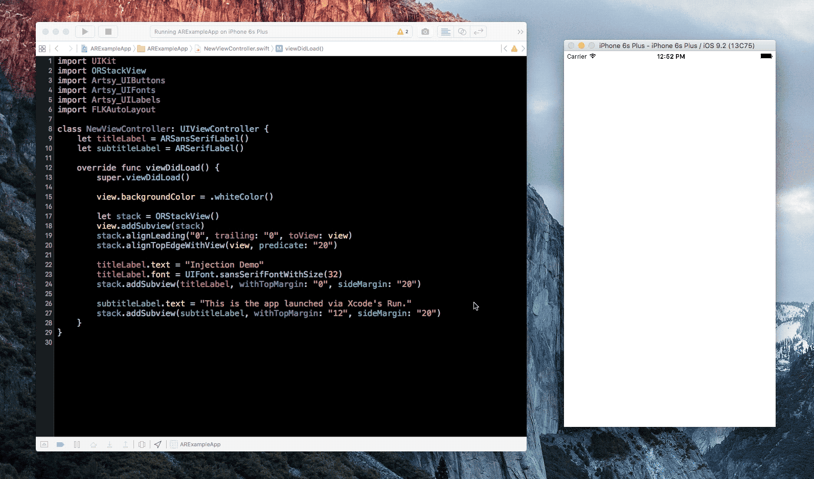
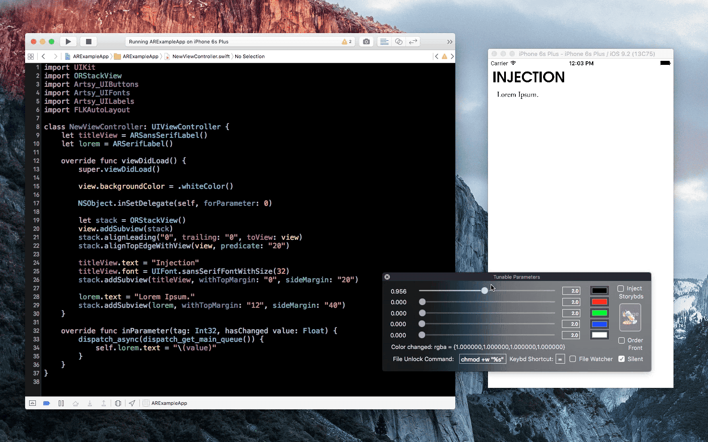

#  Injection Plugin for Xcode

Copyright (c) John Holdsworth 2012-16

# TLDR:

Injection for Xcode is an Xcode plugin (available via [Alcatraz](http://alcatraz.io/)) or [AppCode](#user-content-use-with-appcode) that 
dynamically inserts new Swift / Objective-C code into a running app in order to speed up your build process. It does this without making _any_ changes to your project.



Announcements of major additions to the project will be made on twitter [@Injection4Xcode](https://twitter.com/@Injection4Xcode).

### Stop Press

If you know the trick which I won't detail here plugins still load in Xcode 8 GM and injection has been
updated for it and Swift 3. Patched injection works fine and unpatched injection works if the
"InjectionLoader" bundle is codesigned for the simulator. This is done in a "Run Script" build phase in this
project if you need to update the code signing identity to dis-ambiguate it. Please raise issues 
with any problems or look at [this blog](https://johntmcintosh.com/blog/2016/10/03/code-injection-ios).
One thing I have noticed is you can no longer add methods using injection which was proably never a
particularly good idea in Swift.

### Stop Stop Press

Injection is now available as a standalone app rather than have to build the plugin which you can download [here](http://johnholdsworth.com/injection.html). As injection no longer works on the deivce due to sandboxing in iOS10 this is the recommended route going forward. For more information consult the [FAQ](https://johnno1962.github.io/InjectionApp/injectionfaq.html).

## How to Use Injection for Xcode

For installation and usage for AppCode [see below](#user-content-use-with-appcode). If you're a visual learner, you may appreciate [this video post](http://artsy.github.io/blog/2016/03/05/iOS-Code-Injection/) from [@Orta](https://twitter.com/@orta) covering the basics.

With Xcode, either install via Alcatraz, or install by cloning this repo and build `InjectionPluginLite/InjectionPlugin.xcodeproj`. If you are building locally, note that you need to restart Xcode to load the plugin. A popup should appear asking to confirm loading a plugin not signed by Apple, that signals that the plugin is set up.

The plugin can be removed either via Alcatraz, or by running: `rm -rf ~/Library/Application\ Support/Developer/Shared/Xcode/Plug-ins/InjectionPlugin.xcplugin`

### Simple Proof of Concept Once Installed

Once it is installed, compile and run a project as normal. From here you should take any class that would exist when your 
app is loaded, add a new function `- injected`  and add a breakpoint on that line.

``` objc
- (void)injected
{
    NSLog(@"I've been injected: %@", self);
}
```
or
``` swift
func injected() {
    print("I've been injected: \(self)")
}
```

Then press <kbd>ctrl</kbd>+<kbd>=</kbd>, and you'll see Xcode stop at the breakpoint. You've just injected new code into a running app. **Awesome right?**

### Callbacks in Your Code

You can build on top of Injection from three callbacks:

* `- (void)injected` as an instance method, which gives you the chance to re-update an object with new contexts.
* `+ (void)injected` as a class method, making it possible to update globals with new information
* Listening for `INJECTION_BUNDLE_NOTIFICATION`, allowing other classes to listen out for injection calls, this is useful for providing [app level changes](https://github.com/artsy/eigen/pull/1236).

If you are interested in diving even deeper into callbacks, check out [Tunable Parameters](documentation/tunable_parameters.md).



## Swift Support

Swift support works great when working with a collection of classes. 
However, there are a number of cases where re-injection won't work elegantly with Swift:

 * Making changes to Structs.
 * Changing `func` or `class`es that are marked as `final`.
 * Global `func` or variables that are not constrained into a class.
 * Compiler optimisations can stop injection working. If so, build DEBUG.
 
In day-to-day development against Cocoa/UIKit, it's rare, but possible to hit these cases, 
for more information see [What Happens With Swift?](#what-happens-with-swift)

## How it Works

Injection for Xcode is an extension to the Xcode IDE that allows you to patch the implementation
of a class's method without having to restart the application. 

It performs this by parsing the build logs of the application to determine how a source file was 
last compiled. With this it wraps the result of re-compiling into a bundle which is injected into 
the application using the dynamic loader. At this point there are two versions of a class in the app,
the original and a new modified version from the bundle. The modified version is then "swizzled"
onto the original class so changes take effect.

This swizzling takes advantage of the fact that Objective-C binds method invocations to
implementations at run time. This can also be performed on Swift classes provided that
the method or class is not final or private (i.e. the method can be overridden) by
patching the class' "vtable". This excludes the injection of methods of structs.

## What Else Does This Plugin Do?

* It has file watcher that can inject when a file is saved from whichever editor you use. Enable this in the preferences pane accessed on menu item "Product/Injection Plugin/Tunable Parameters": "File Watcher".

* There is support for working specifically with [Storyboard-based iOS projects](documentation/storyboards.md).

* The plugin offers a way to quickly change a [collection of tunable parameters](documentation/tunable_parameters.md)

* Xcode is given a badge, showing the number of active Injection connections to apps.

* When you start using Injection, a new Xcode Project is added to the same folder as your
project (either `iOSInjectionProject` or `OSXInjectionProject`.) This is the xcode project base
for the changes which are injected into your project, it is recommended to add this to your `.gitignore`.

* Each time a project is injected, `injectionCount.txt` in the injection project's directory (above) is incremented. This can give you a sense of how much time you save (number of injections * amount saved per injection = a happier you).

* The injection key command can be customised from <kbd>ctrl</kbd>+<kbd>=</kbd> in the "Tunable App Parameters" panel.

* Works on a device, if you apply a [patch to your project.](documentation/patching_injection.md).

* Perform unit tests that cover your Swift class/struct/enum. For details see [TDD with Injection for Xcode](documentation/tdd.md)

## What Happens with Swift?


Swift, presents a few more stumbling blocks for the uninitiated. Provided that methods are of
a non final class and are non final (this excludes structs alas) they can be injected.
In this example the `sharedInstance` variable is declared `static` rather than "class" to make
sure it is not injected to ensure there is only ever one singleton. For the "injected"
methods to work your class _must_ inherit from NSObject.

More problematic is the more common use of variables or functions outside a class which are
referred to across the files of a bundle. Swift 1.2+ takes the view these "internal" scope
symbols should not be available across bundles and are made "private extern" in
their object file making them unavailable at run time. This means that the above code
will inject but injecting another file referring to the dispatch_on_main function will fail
with obscure dynamic loading errors.

The simplest solution is to make these variables and functions public though, for a framework,
this may be unsatisfactory. The alternative is to patch the object files of the project to remove the
private extern flag and relink the bundle. In order to do this a script `~/bin/unhide.sh`
is created by the plugin build which should be called as an additional "Run Script"
build phase after linking your app to perform this patch and relink. 

## Use with AppCode 

Injection can be used from inside AppCode provided the application [has been patched](documentation/patching_injection.md) and
you have previously injected that project from inside Xcode to set up a link to the 
build logs. 

To install, download the jar file `InjectionPluginAppCode/Injection.jar` from this repo 
and go to AppCode preferences, choose "Install plugin from disk" and locate the .jar.
Then restart the IDE. Now you will get new menu options under the Run menu.
You’ll need to re-patch the project from inside AppCode as it uses a different port number to connect.

## Limitations of Injection

There are limitations of course, largely centering around static variables, static or global
functions and their Swift equivalents. Consider the following Objective-C code.


* One potential problem is when the new version of the class is loaded, it comes with it's own
versions of static variables such as `sharedInstance` and the `once` token.  After injection 
has occurred, this would generate a new singleton instance. 

  To prevent this, class methods with the prefix "shared" are not swizzled on injection to 
support this common idiom.

* It can be tough to look through all of the memory of a running application. In order to determine the classes and instances to call the `injected` callbacks on, Injection performs a "sweep" to find all objects in memory. Roughly, this involves looking at an object, then recursively looking through objects which it refers to. For example, the object's instance variables and properties.

  This process is seeded using the application's delegate and all windows. Once all the in-memory reference are collected, Injection will then filter these references to ones that it has compiled and injected. Then sending them the messages referenced in the [callbacks section](##user-content-callbacks-in-your-code).
  
  If no references are found, Injection will look through all objects that are referred to via `sharedInstance`. If that fails, well, Injection couldn't find your instance. This is one way in which
  you may miss callbacks in your app.

* The function `dispatch_on_main` does not inject, as it has been statically linked into
the application. It does however, inject by proxy in the case shown via the `doSomething`
method. `dispatch_on_main` will have been linked locally to a version in the object file being injected.

