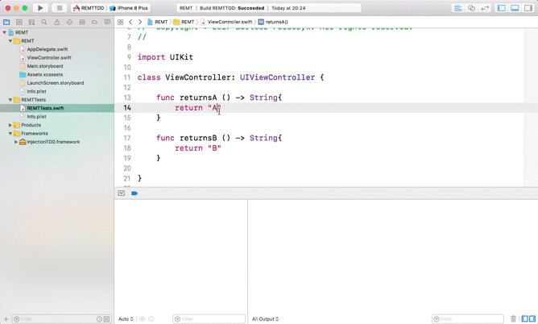

## TDD with Injection for Xcode (Swift only)

If you want to automatically run unit tests related to your injected file, integrate your project test target with [InjectionTDD](https://github.com/polac24/InjectionTDD)

You can either add to your test target compiled [`.framework`](https://github.com/polac24/InjectionTDD/releases) or add pod to your `Podfile`:

```ruby
...
  target 'TargetWithTests' do
    # Your test Pods

    pod 'InjectionTDD', '~> 0.4'
  end
```

Then, begin standard unit tests (⌘+U). Then, everytime you inject new Swift file, Injection for Xcode automatically finds related unit tests, execute them and all results are presented in the standard Xcode interface:



For more details, take a look on [InjectionTDD](https://github.com/polac24/InjectionTDD).
